<div align="center">


<br/>


<br/>

[](https://github.com/ayansayyad7000-png)
[](mailto:ayansayyad7486@gmail.com)


</div>

---

## ⚡ About Me

<div align="center">
</div>

```yaml
name: Ayan Sayyad
education: B.Tech Information Technology
focus: Data Engineering • Cloud • DevOps • AI Platform Engineering
building: Data systems • Cloud labs • Automation • AI projects
learning: Kafka • Airflow • Spark • Kubernetes • Terraform
motto: "Build. Learn. Improve. Repeat."
```

<div align="center">

</div>

---

## ⚡ Live Engineering Stream

<div align="center">
</div>

---

## 🚀 Featured Projects

<table>
<tr>
<td width="50%" valign="top">

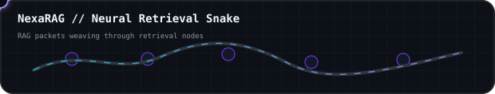

### 🧠 NexaRAG AI Research Copilot
AI research assistant built around Retrieval-Augmented Generation concepts.

**Python • RAG • FastAPI • Streamlit • Docker**

[Open Project →](https://github.com/ayansayyad7000-png/NexaRAG-AI-Research-Copilot)

</td>
<td width="50%" valign="top">

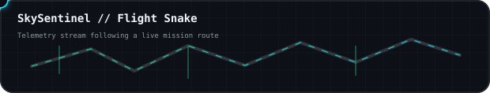

### 🚁 SkySentinel Drone Platform
Drone control and real-time telemetry/monitoring with computer-vision concepts.

**Python • MAVLink • ArduPilot • OpenCV • WebSocket**

[Open Project →](https://github.com/ayansayyad7000-png/SkySentinel-Drone-Control-Monitoring)

</td>
</tr>
<tr>
<td width="50%" valign="top">

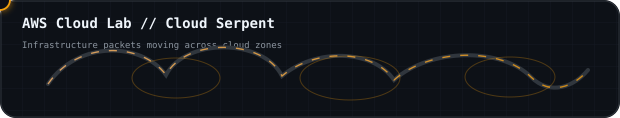

### ☁️ AWS Cloud Lab
Hands-on AWS practice with cloud infrastructure and Linux.

**AWS • EC2 • S3 • IAM • CloudWatch • Linux**

[Open Project →](https://github.com/ayansayyad7000-png/My-cloud)

</td>
<td width="50%" valign="top">

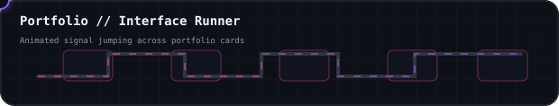

### 🌐 Developer Portfolio
Personal portfolio for projects, skills and engineering work.

**Web • Portfolio • Projects • Personal Branding**

[Open Project →](https://github.com/ayansayyad7000-png/portfolio)

</td>
</tr>
</table>

---

## 🧩 Engineering Lab

<table>
<tr>
<td width="50%" valign="top">
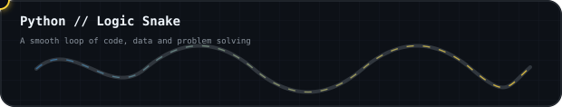

### 🐍 Python
Fundamentals, logic practice and revision notes.

[Python-Notes →](https://github.com/ayansayyad7000-png/Python-Notes)
</td>
<td width="50%" valign="top">
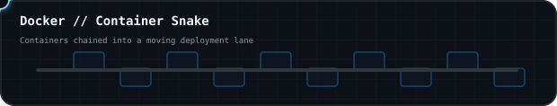

### 🐳 Docker
Containers, images, Compose and practical commands.

[docker →](https://github.com/ayansayyad7000-png/docker)
</td>
</tr>

<tr>
<td width="50%" valign="top">
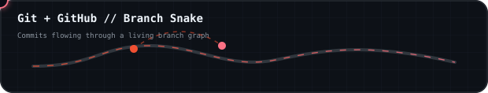

### 🔧 Git + GitHub
Version control and GitHub workflow practice.

[git-and-github →](https://github.com/ayansayyad7000-png/git-and-github)
</td>
<td width="50%" valign="top">
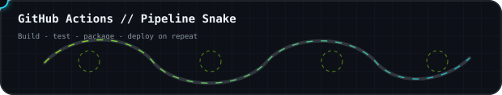

### ⚙️ GitHub Actions
Python CI and automation workflow practice.

[GitHub-Actions-Python-CI →](https://github.com/ayansayyad7000-png/GitHub-Actions-Python-CI)
</td>
</tr>

<tr>
<td width="50%" valign="top">
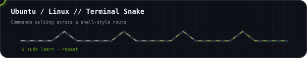

### 🐧 Ubuntu / Linux
Linux command practice and terminal fundamentals.

[Ubuntu Commands →](https://github.com/ayansayyad7000-png/Ubuntu-Command-Repository-)
</td>
<td width="50%" valign="top">
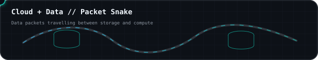

### ☁️ Cloud + Data
AWS labs, compute, storage and cloud practice.

[My-cloud →](https://github.com/ayansayyad7000-png/My-cloud)
</td>
</tr>

<tr>
<td colspan="2" valign="top">
<div align="center">
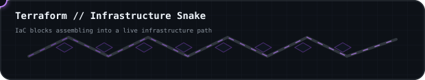
</div>

### 🏗️ Terraform / Infrastructure as Code
Infrastructure automation and Terraform scripting practice.

[terrafom-script- →](https://github.com/ayansayyad7000-png/terrafom-script-)
</td>
</tr>
</table>

---

## 🛰️ Engineering Path

<div align="center">
</div>

```text
FOUNDATION
   │
   ├── Python
   ├── SQL
   ├── Linux
   └── Git / GitHub
          │
          ▼
DATA + CLOUD
   │
   ├── AWS
   ├── ETL / Pipelines
   ├── PostgreSQL
   ├── Kafka
   ├── Airflow
   └── Spark
          │
          ▼
DEVOPS + PLATFORM
   │
   ├── Docker
   ├── GitHub Actions
   ├── Terraform
   └── Kubernetes
          │
          ▼
AI PLATFORM ENGINEERING
```

---

## 📊 GitHub Signal

<div align="center">

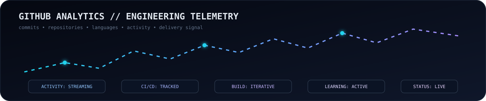

<br/>


<br/>


</div>

---

## 🎯 Current Direction

<div align="center">
</div>

```text
[ BUILDING ]   Data systems • Cloud labs • Automation • AI projects
[ LEARNING ]   Kafka • Airflow • Spark • Kubernetes • Terraform
[ TARGETING ]  Data Engineering • Cloud • DevOps • AI Platform Engineering
```

<div align="center">

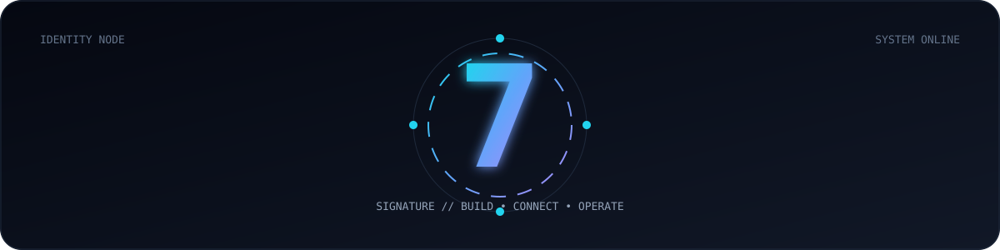

### `BUILD → LEARN → IMPROVE → REPEAT`

**Ayan Sayyad**  
B.Tech Information Technology  
**Data Engineering • Cloud • DevOps • AI Platform Engineering**

📧 **ayansayyad7486@gmail.com**

</div>
