<div align="center">



<br/>


<br/>

[](https://github.com/ayansayyad7000-png)
[](mailto:ayansayyad7486@gmail.com)


</div>

---

## `01 / PROFILE`

I am a **B.Tech Information Technology student** building toward **Data Engineering, Cloud, DevOps and AI Platform Engineering**.

My focus is simple: understand the fundamentals, build hands-on projects, connect the tools together, and turn theory into working systems.

```text
CURRENT MODE
├─ Build data + cloud projects
├─ Practice Linux, Git, Docker and AWS
├─ Learn CI/CD and Infrastructure as Code
└─ Grow toward production-ready data platforms
```

---

## `02 / STACK`

<div align="center">


</div>

<br/>

| Area | Technologies |
|---|---|
| **Data** | Python · SQL · MySQL · PostgreSQL |
| **Cloud** | AWS · EC2 · S3 · IAM · CloudWatch |
| **DevOps** | Linux · Git · GitHub · Docker · GitHub Actions |
| **Infrastructure** | Terraform · Kubernetes *(learning)* |
| **AI / Backend** | FastAPI · RAG concepts · OpenCV |

---

## `03 / FEATURED BUILDS`

<table>
<tr>
<td width="50%" valign="top">

### 🧠 NexaRAG
**AI Research Copilot**

A practical RAG-focused project for exploring document retrieval, AI-assisted research and backend integration.

`Python` `RAG` `FastAPI` `Docker`

[View repository →](https://github.com/ayansayyad7000-png/NexaRAG-AI-Research-Copilot)

</td>
<td width="50%" valign="top">

### 🚁 SkySentinel
**Drone Control & Monitoring**

Python-based drone project focused on MAVLink communication, telemetry, monitoring and computer-vision concepts.

`Python` `MAVLink` `ArduPilot` `OpenCV`

[View repository →](https://github.com/ayansayyad7000-png/SkySentinel-Drone-Control-Monitoring)

</td>
</tr>
<tr>
<td width="50%" valign="top">

### ☁️ My Cloud
**AWS Practical Lab**

Hands-on cloud exercises covering AWS services, Linux commands and practical infrastructure learning.

`AWS` `EC2` `S3` `IAM` `Linux`

[View repository →](https://github.com/ayansayyad7000-png/My-cloud)

</td>
<td width="50%" valign="top">

### ⚙️ DevOps Practice
**Git → CI/CD → Docker → Cloud**

Step-by-step repositories for Git, GitHub Actions, Docker, Linux and infrastructure practice.

`Git` `GitHub Actions` `Docker` `Terraform`

[Git & GitHub →](https://github.com/ayansayyad7000-png/git-and-github) · [Docker →](https://github.com/ayansayyad7000-png/docker)

</td>
</tr>
</table>

---

## `04 / SYSTEM FLOW`

```text
┌──────────────┐    ┌──────────┐    ┌──────────────┐    ┌────────────┐    ┌───────────┐
│ Local Laptop │ -> │   Git    │ -> │    GitHub    │ -> │ CI / CD    │ -> │ AWS / EC2 │
└──────────────┘    └──────────┘    └──────────────┘    └────────────┘    └───────────┘
       │                                      │                  │               │
       └── Python / Linux                     ├── Versioning     ├── Automate    └── Deploy
                                              └── Collaboration  └── Validate
```

> I am actively learning how tools connect as one engineering workflow—not as isolated commands.

---

## `05 / LEARNING ROADMAP`

- **Data Engineering:** ETL/ELT, data modeling, Spark, Kafka, Airflow
- **Cloud:** AWS architecture, networking, IAM and monitoring
- **DevOps:** Docker, CI/CD, Terraform and Kubernetes
- **AI Platform:** APIs, model-serving concepts, RAG systems and observability

---

## `06 / GITHUB SIGNAL`

<div align="center">


<br/>


</div>

---

<div align="center">

### `BUILD → LEARN → IMPROVE → REPEAT`

**Ayan Sayyad**  
B.Tech Information Technology  
Data Engineering · Cloud · DevOps · AI Platform Engineering

</div>
