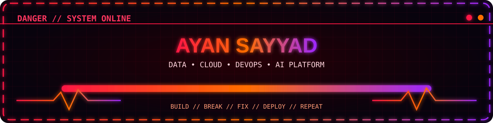
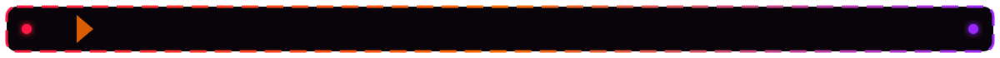

<div align="center">




[](https://github.com/ayansayyad7000-png)
[](mailto:ayansayyad7486@gmail.com)

</div>



<table width="100%"><tr><td>

## ⚡ About Me

I am a B.Tech Information Technology student building toward a career in **Data Engineering and AI Platform Engineering**.

My focus is on building practical systems where **data, cloud infrastructure, automation and AI** work together.

- 🎯 Career direction: **Data Engineer → Data Platform Engineer → AI Platform Engineer**
- ☁️ Building with: **AWS, Linux, Git, Docker and GitHub Actions**
- 📊 Learning: **Apache Spark, Kafka, Airflow and Databricks**
- ⚙️ Exploring: **Kubernetes, Terraform, MLflow and production AI systems**
- 🔥 Mode: **Learn → Build → Break → Fix → Improve → Deploy**

<div align="center">

</div>

</td></tr></table>


<table width="100%"><tr><td>

## 🔥 Tech Arsenal

<div align="center">

### Languages & Data


### Cloud • DevOps • Systems


### Development Tools


<br/><br/>


</div>

> **Core:** Python • SQL • AWS • Linux • Git • GitHub  
> **Growing:** Docker • GitHub Actions • PostgreSQL • FastAPI  
> **Learning:** Spark • Kafka • Airflow • Databricks • Kubernetes • Terraform • MLflow

</td></tr></table>


<table width="100%"><tr><td>

## 🎮 Featured Builds

<div align="center">

</div>

<table>
<tr>
<td width="50%" valign="top">

### 🧠 NexaRAG AI Research Copilot
AI research assistant built around Retrieval-Augmented Generation concepts.

**Tech:** Python • RAG • FastAPI • Streamlit • Docker

[View Repository →](https://github.com/ayansayyad7000-png/NexaRAG-AI-Research-Copilot)

</td>
<td width="50%" valign="top">

### 🚁 SkySentinel Drone Platform
Python-based drone control and real-time monitoring project using telemetry and computer vision concepts.

**Tech:** Python • MAVLink • ArduPilot • OpenCV • WebSocket

[View Repository →](https://github.com/ayansayyad7000-png/SkySentinel-Drone-Control-Monitoring)

</td>
</tr>
<tr>
<td width="50%" valign="top">

### ☁️ AWS Cloud Practice
Hands-on AWS repository containing practical cloud exercises and step-by-step notes.

**Tech:** AWS • EC2 • S3 • IAM • CloudWatch • Linux

[View Repository →](https://github.com/ayansayyad7000-png/My-cloud)

</td>
<td width="50%" valign="top">

### 🔧 Git & GitHub Guide
Beginner-friendly practical Git and GitHub guide covering commits, SSH, branches, merge, reset, revert, push and pull.

**Tech:** Git • GitHub • SSH • Version Control

[View Repository →](https://github.com/ayansayyad7000-png/git-and-github)

</td>
</tr>
</table>

</td></tr></table>


<table width="100%"><tr><td>

## 🧩 Learning Repositories

| Repository | Focus |
|---|---|
| [Python Notes](https://github.com/ayansayyad7000-png/Python-Notes) | Python fundamentals, examples and practice |
| [Ubuntu Command Repository](https://github.com/ayansayyad7000-png/Ubuntu-Command-Repository-) | Linux, Ubuntu and command-line practice |
| [GitHub Actions Python CI](https://github.com/ayansayyad7000-png/GitHub-Actions-Python-CI) | CI/CD automation using GitHub Actions |
| [Git & GitHub](https://github.com/ayansayyad7000-png/git-and-github) | Complete Git and GitHub practical guide |

<div align="center">

</div>

</td></tr></table>


<table width="100%"><tr><td>

## ⚔️ Current Power-Up Path

```text
Python + SQL + Git + Linux
            ↓
          AWS Cloud
            ↓
Docker + GitHub Actions + Terraform
            ↓
Kafka + Airflow + Spark + Databricks
            ↓
Kubernetes + Observability
            ↓
Data Platform Engineering
            ↓
AI Platform Engineering
```

<div align="center">

</div>

</td></tr></table>


<table width="100%"><tr><td>

## 📈 GitHub Battle Stats

<div align="center">


<br/><br/>


</div>

</td></tr></table>


<table width="100%"><tr><td>

## 🐍 Danger Contribution Snake

<div align="center">

<picture>
  <source media="(prefers-color-scheme: dark)" srcset="https://raw.githubusercontent.com/ayansayyad7000-png/ayansayyad7000-png/output/github-contribution-grid-snake-dark.svg" />
  <source media="(prefers-color-scheme: light)" srcset="https://raw.githubusercontent.com/ayansayyad7000-png/ayansayyad7000-png/output/github-contribution-grid-snake.svg" />
  
</picture>

<br/>


</div>

</td></tr></table>


<table width="100%"><tr><td>

## 🚨 Final Objective

I want to build systems at the intersection of **data, cloud infrastructure and AI** — reliable pipelines, scalable platforms, automated deployments, observability, and production-ready data/AI services.

<div align="center">

</div>

</td></tr></table>


<div align="center">

### 🔥 BUILD • BREAK • FIX • DEPLOY • REPEAT 🔥

**Ayan Sayyad**  
B.Tech Information Technology  
Data Engineering • Cloud • DevOps • AI Platform Engineering

📧 **ayansayyad7486@gmail.com**


</div>