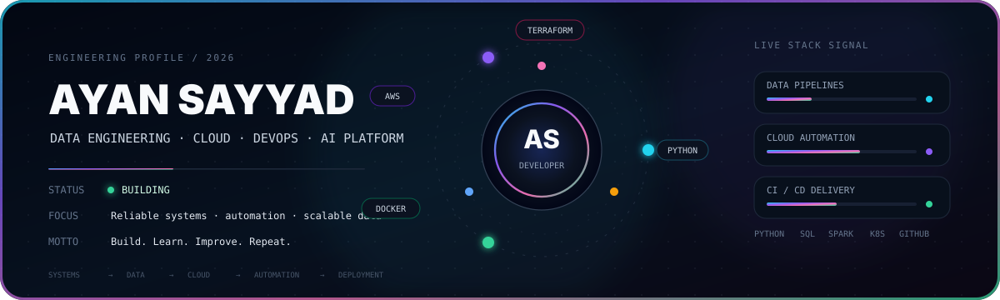

<div align="center">



<br/>


<br/>

[](https://github.com/ayansayyad7000-png)
[](mailto:ayansayyad7486@gmail.com)


</div>

## 01 / Profile

```yaml
name: Ayan Sayyad
education: B.Tech Information Technology
focus:
  - Data Engineering
  - Cloud Computing
  - DevOps
  - AI Platform Engineering

currently_learning:
  - Apache Kafka
  - Apache Airflow
  - Apache Spark
  - Kubernetes
  - Terraform

motto: "Build. Learn. Improve. Repeat."
```

## 02 / Tech Stack

<div align="center">


</div>

<br/>

| Data | Cloud | DevOps | Platform |
|---|---|---|---|
| Python | AWS | Docker | Linux |
| SQL | EC2 / S3 / IAM | GitHub Actions | FastAPI |
| PostgreSQL | CloudWatch | Terraform | Kubernetes |
| Spark | Cloud Labs | Git / GitHub | Automation |

## 03 / What I Build

<table>
<tr>
<td width="50%" valign="top">

### 🧠 NexaRAG AI Research Copilot
Retrieval-Augmented Generation based research assistant.

`Python` `RAG` `FastAPI` `Streamlit` `Docker`

[View repository →](https://github.com/ayansayyad7000-png/NexaRAG-AI-Research-Copilot)

</td>
<td width="50%" valign="top">

### 🚁 SkySentinel Drone Platform
Drone control, telemetry monitoring and computer-vision concepts.

`Python` `MAVLink` `ArduPilot` `OpenCV` `WebSocket`

[View repository →](https://github.com/ayansayyad7000-png/SkySentinel-Drone-Control-Monitoring)

</td>
</tr>
<tr>
<td width="50%" valign="top">

### ☁️ AWS Cloud Lab
Hands-on cloud infrastructure, Linux and AWS practice.

`AWS` `EC2` `S3` `IAM` `CloudWatch` `Linux`

[View repository →](https://github.com/ayansayyad7000-png/My-cloud)

</td>
<td width="50%" valign="top">

### 🌐 Developer Portfolio
A focused portfolio for engineering projects and technical work.

`Web` `Projects` `Engineering` `Personal Brand`

[View repository →](https://github.com/ayansayyad7000-png/portfolio)

</td>
</tr>
</table>

## 04 / Engineering Path

```text
FOUNDATION
Python ── SQL ── Linux ── Git
   │
   ▼
DATA ENGINEERING
ETL ── PostgreSQL ── Kafka ── Airflow ── Spark
   │
   ▼
CLOUD + DEVOPS
AWS ── Docker ── GitHub Actions ── Terraform
   │
   ▼
PLATFORM
Kubernetes ── Automation ── AI Platform Engineering
```

## 05 / Practice Labs

[](https://github.com/ayansayyad7000-png/Python-Notes)
[](https://github.com/ayansayyad7000-png/docker)
[](https://github.com/ayansayyad7000-png/git-and-github)
[](https://github.com/ayansayyad7000-png/GitHub-Actions-Python-CI)
[](https://github.com/ayansayyad7000-png/Ubuntu-Command-Repository-)
[](https://github.com/ayansayyad7000-png/terrafom-script-)

## 06 / GitHub Signal

<div align="center">


<br/>


</div>

## 07 / Current Direction

```text
BUILDING   → Data systems • Cloud labs • Automation • AI projects
LEARNING   → Kafka • Airflow • Spark • Kubernetes • Terraform
TARGETING  → Data Engineering • Cloud • DevOps • AI Platform Engineering
```

<div align="center">

### `BUILD → LEARN → IMPROVE → REPEAT`

**Ayan Sayyad**  
B.Tech Information Technology  
Data Engineering • Cloud • DevOps • AI Platform Engineering

</div>
