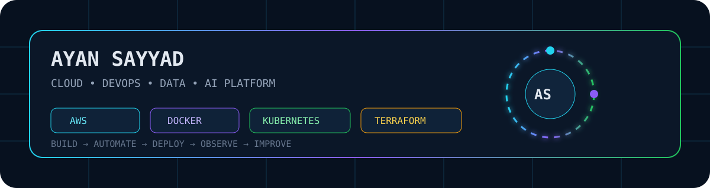
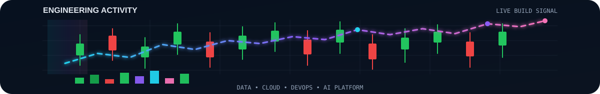

<div align="center">



<br/>


<br/>

[](https://github.com/ayansayyad7000-png)
[](https://github.com/ayansayyad7000-png/My-cloud)
[](https://github.com/ayansayyad7000-png/kobernets-)


</div>

---

## 👨‍💻 Engineering Profile

```yaml
name: Ayan Sayyad
education: B.Tech Information Technology

engineering_focus:
  - Cloud Engineering
  - DevOps
  - Data Engineering
  - AI Platform Engineering

core_stack:
  - Python
  - SQL
  - AWS
  - Linux
  - Docker
  - Kubernetes
  - Terraform
  - GitHub Actions

currently_building:
  - Cloud labs
  - Kubernetes practice
  - Infrastructure automation
  - AI and data projects

motto: "Build. Learn. Improve. Repeat."
```

I build hands-on projects around **cloud infrastructure, automation, containers, data systems and AI platforms**.  
My repositories focus on learning by building real configurations, deployment workflows and practical engineering labs.

---

## ⚙️ Core Stack

<div align="center">


</div>

<br/>

| Domain | Technologies |
|---|---|
| **Cloud** | AWS, EC2, S3, IAM, CloudWatch |
| **DevOps** | Docker, Kubernetes, GitHub Actions, CI/CD |
| **Infrastructure** | Terraform, Linux, Networking |
| **Data** | Python, SQL, PostgreSQL, MySQL, Spark |
| **AI Platform** | FastAPI, RAG, Automation, Model-serving concepts |

---

## 🚀 Featured Engineering Work

<table>
<tr>
<td width="50%" valign="top">

### ☸️ Kubernetes Learning Lab
Complete Kubernetes theory, architecture, kubectl commands, YAML manifests, networking, storage, security and practical Nginx deployment.

**Stack:** `Kubernetes` `YAML` `kubectl` `DevOps`

[Explore Kubernetes repo →](https://github.com/ayansayyad7000-png/kobernets-)

</td>
<td width="50%" valign="top">

### 🧠 NexaRAG AI Research Copilot
Research copilot using Retrieval-Augmented Generation with API and deployment workflows.

**Stack:** `Python` `RAG` `FastAPI` `Docker`

[Explore NexaRAG →](https://github.com/ayansayyad7000-png/NexaRAG-AI-Research-Copilot)

</td>
</tr>

<tr>
<td width="50%" valign="top">

### ☁️ AWS Cloud Lab
Hands-on AWS, Linux and cloud infrastructure practice.

**Stack:** `AWS` `EC2` `S3` `IAM` `CloudWatch`

[Explore AWS lab →](https://github.com/ayansayyad7000-png/My-cloud)

</td>
<td width="50%" valign="top">

### 🚁 SkySentinel Drone Platform
Drone control and monitoring concepts with telemetry and computer-vision components.

**Stack:** `Python` `MAVLink` `ArduPilot` `OpenCV`

[Explore SkySentinel →](https://github.com/ayansayyad7000-png/SkySentinel-Drone-Control-Monitoring)

</td>
</tr>
</table>

---

## 🧭 DevOps Engineering Pipeline

<div align="center">

```text
CODE
  ↓
GIT / GITHUB
  ↓
CI/CD
  ↓
DOCKER
  ↓
KUBERNETES
  ↓
AWS CLOUD
  ↓
MONITORING
  ↓
AUTOMATION & IMPROVEMENT
```

</div>

---

## 🧪 Hands-on Labs

<div align="center">

[](https://github.com/ayansayyad7000-png/kobernets-)
[](https://github.com/ayansayyad7000-png/docker)
[](https://github.com/ayansayyad7000-png/Terraform)
[](https://github.com/ayansayyad7000-png/GitHub-Actions-Python-CI)
[](https://github.com/ayansayyad7000-png/Ubuntu-Command-Repository-)
[](https://github.com/ayansayyad7000-png/git-and-github)

</div>

---

## 📊 GitHub Activity

<div align="center">


<br/>


</div>

---

## 🎯 Current Direction

<div align="center">

**Cloud Infrastructure** · **DevOps Automation** · **Kubernetes** · **Data Engineering** · **AI Platforms**

<br/>

`BUILD` → `AUTOMATE` → `DEPLOY` → `OBSERVE` → `IMPROVE`

<br/><br/>



</div>

<!-- profile-refresh-2026 -->
<div align="center"><sub>Profile refreshed: 26 September 2026</sub></div>
