<div align="center">


<br/>


<br/>

[](https://github.com/ayansayyad7000-png)
[](mailto:ayansayyad7486@gmail.com)


</div>

---

## ⚡ About Me

<div align="center">

</div>

<br/>

```text
> B.Tech Information Technology
> Focus     : Data Engineering • Cloud • DevOps • AI Platform Engineering
> Building  : Data systems • Cloud labs • Automation • AI projects
> Learning  : Kafka • Airflow • Spark • Databricks • Kubernetes • Terraform
> Mindset   : Build. Learn. Improve. Repeat.
```

<div align="center">


</div>

---

## ⚡ Live Engineering Stream

<div align="center">

</div>

---

## 🚀 Featured Projects

<div align="center">

</div>

<table>
<tr>
<td width="50%" valign="top">

### 🧠 NexaRAG AI Research Copilot
AI research assistant built around Retrieval-Augmented Generation concepts.

**Python • RAG • FastAPI • Streamlit • Docker**

[Open Project →](https://github.com/ayansayyad7000-png/NexaRAG-AI-Research-Copilot)

</td>
<td width="50%" valign="top">

### 🚁 SkySentinel Drone Platform
Drone control and real-time telemetry/monitoring project with computer-vision concepts.

**Python • MAVLink • ArduPilot • OpenCV • WebSocket**

[Open Project →](https://github.com/ayansayyad7000-png/SkySentinel-Drone-Control-Monitoring)

</td>
</tr>
<tr>
<td width="50%" valign="top">

### ☁️ AWS Cloud Lab
Hands-on AWS practice repository with practical cloud exercises and commands.

**AWS • EC2 • S3 • IAM • CloudWatch • Linux**

[Open Project →](https://github.com/ayansayyad7000-png/My-cloud)

</td>
<td width="50%" valign="top">

### 🌐 Developer Portfolio
Personal portfolio project for showcasing skills, projects and engineering work.

**Web • Portfolio • Projects • Personal Branding**

[Open Project →](https://github.com/ayansayyad7000-png/portfolio)

</td>
</tr>
</table>

---

## 🧩 All Public Repositories

> Everything public on my GitHub is visible here from the profile front page.

<div align="center">

</div>

<br/>

| Repository | What it contains |
|---|---|
| [🧠 NexaRAG-AI-Research-Copilot](https://github.com/ayansayyad7000-png/NexaRAG-AI-Research-Copilot) | AI / RAG research copilot project |
| [🚁 SkySentinel-Drone-Control-Monitoring](https://github.com/ayansayyad7000-png/SkySentinel-Drone-Control-Monitoring) | Drone control, telemetry and monitoring |
| [☁️ My-cloud](https://github.com/ayansayyad7000-png/My-cloud) | AWS cloud practical work |
| [🌐 portfolio](https://github.com/ayansayyad7000-png/portfolio) | Personal developer portfolio |
| [🐍 Python-Notes](https://github.com/ayansayyad7000-png/Python-Notes) | Python fundamentals and revision notes |
| [🐳 docker](https://github.com/ayansayyad7000-png/docker) | Docker installation, containers and practical commands |
| [🔧 git-and-github](https://github.com/ayansayyad7000-png/git-and-github) | Git + GitHub step-by-step practical guide |
| [📘 Git-GitHub-Practical](https://github.com/ayansayyad7000-png/Git-GitHub-Practical) | Additional Git/GitHub practical work |
| [⚙️ GitHub-Actions-Python-CI](https://github.com/ayansayyad7000-png/GitHub-Actions-Python-CI) | Python CI using GitHub Actions |
| [🐧 Ubuntu-Command-Repository-](https://github.com/ayansayyad7000-png/Ubuntu-Command-Repository-) | Ubuntu/Linux command practice |
| [🧪 amgmu-demo](https://github.com/ayansayyad7000-png/amgmu-demo) | Demo repository |
| [👤 ayansayyad7000-png](https://github.com/ayansayyad7000-png/ayansayyad7000-png) | GitHub profile source and assets |

---

## 🛰️ Engineering Path

<div align="center">


</div>

---

## 📊 GitHub Signal

<div align="center">


<br/>


</div>

---

## 🎯 Current Direction

I am building toward **Data Engineering and AI Platform Engineering** by combining data pipelines, cloud infrastructure, DevOps automation and production AI tooling.

<div align="center">


<br/>

### `BUILD → LEARN → IMPROVE → REPEAT`

**Ayan Sayyad**  
B.Tech Information Technology  
**Data Engineering • Cloud • DevOps • AI Platform Engineering**

📧 **ayansayyad7486@gmail.com**

</div>
