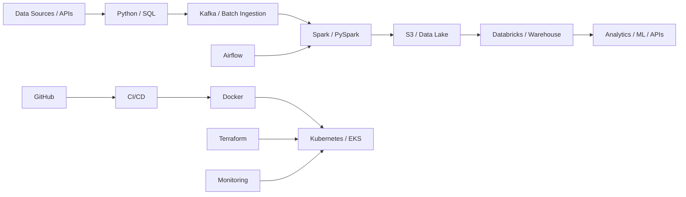

<div align="center">

<picture>
  <source media="(prefers-color-scheme: dark)" srcset="https://raw.githubusercontent.com/ayansayyad7000-png/ayansayyad7000-png/main/assets/ayan-dev-terminal.svg" />
  <source media="(prefers-color-scheme: light)" srcset="https://raw.githubusercontent.com/ayansayyad7000-png/ayansayyad7000-png/main/assets/ayan-dev-terminal-light.svg" />
  
</picture>

<br/>


<br/>


<br/><br/>

<strong>B.Tech Information Technology student building toward Data Engineering and AI Platform Engineering through hands-on cloud, DevOps, data and automation projects.</strong>

</div>

---

## Engineering Snapshot

```text
$ whoami
Ayan Sayyad

$ current_direction
Data Engineer  →  Data Platform Engineer  →  AI Platform Engineer

$ learning_style
Understand the system → build it → connect the tools → break it → fix it → document it

$ current_stack
Python | SQL | AWS | Linux | Git | Docker | Terraform | Kubernetes | Kafka | Airflow | Spark | Databricks
```

I am interested in the layer where **software, infrastructure and data meet**: ingesting data, processing it reliably, automating deployments, operating cloud infrastructure and gradually building production-style platforms instead of isolated scripts.

---

## My Systems Map



**How I think about the stack:** data flows through the platform, while DevOps tools make the platform repeatable, deployable and observable.

---

## Featured Engineering Work

<table>
<tr>
<td width="50%" valign="top">

### Data + DevOps Learning Platform

A structured repository for understanding how Linux, cloud, containers, Kubernetes, Kafka, Airflow, Spark, Databricks and MLOps connect in one system.

`DevOps` `Data Engineering` `AWS` `Kafka` `Spark` `Kubernetes`

**Highlights**
- Tool-by-tool beginner explanations
- English + simple Hindi/Hinglish notes
- Connection playbooks between tools
- End-to-end practical learning path
- Data Engineer extras outside the course syllabus

### [Explore Devops- →](https://github.com/ayansayyad7000-png/Devops-)

</td>
<td width="50%" valign="top">

### AWS Cloud Engineering Practicals

Hands-on AWS labs written as repeatable practicals with console navigation, terminal commands and verification steps.

`EC2` `S3` `IAM` `CloudWatch` `EBS` `AWS CLI`

**Highlights**
- EC2 and Ubuntu administration
- S3 data pipeline basics
- CloudWatch logs and metrics
- IAM roles and secure access
- Automation using bootstrap scripts

### [Explore My-cloud →](https://github.com/ayansayyad7000-png/My-cloud)

</td>
</tr>
<tr>
<td width="50%" valign="top">

### NexaRAG AI Research Copilot

A local RAG-powered AI system for asking questions over personal documents with source-grounded answers.

`Python` `RAG` `FastAPI` `Streamlit` `Docker` `Ollama`

**Highlights**
- Multi-format document ingestion
- Semantic retrieval and embeddings
- Source-grounded responses
- API + web interface
- Docker, tests and CI foundations

### [Explore NexaRAG →](https://github.com/ayansayyad7000-png/NexaRAG-AI-Research-Copilot)

</td>
<td width="50%" valign="top">

### SkySentinel Drone Platform

Python-based drone control and real-time monitoring project built around telemetry, APIs and operational visibility.

`Python` `MAVLink` `ArduPilot` `FastAPI` `OpenCV` `WebSocket`

**Highlights**
- Live telemetry streaming
- Flight health monitoring
- WebSocket dashboard architecture
- Logging and safety-oriented controls
- Container and CI foundations

### [Explore SkySentinel →](https://github.com/ayansayyad7000-png/SkySentinel-Drone-Control-Monitoring)

</td>
</tr>
</table>

---

## Technical Toolbox

<div align="center">


<br/><br/>

`Python` · `SQL` · `PostgreSQL` · `Linux` · `AWS` · `Git/GitHub` · `Docker` · `Terraform` · `Kubernetes/EKS`  
`Kafka` · `Airflow` · `Spark/PySpark` · `Databricks` · `GitHub Actions` · `CloudWatch` · `MLflow`

</div>

### What I am strengthening now

| Area | What I am learning | Why it matters |
|---|---|---|
| Data Engineering | Advanced SQL, Python, PySpark, Data Modeling | Build reliable pipelines and transformations |
| Streaming | Kafka + Spark | Process event data in near real time |
| Orchestration | Airflow | Schedule and coordinate data workflows |
| Cloud Data | S3, Glue, Athena, Redshift, EMR, Kinesis | Build AWS-native data systems |
| Platform Engineering | Docker, Kubernetes, Terraform, ArgoCD | Deploy and operate services consistently |
| Lakehouse | Databricks, Delta Lake, Iceberg | Work with modern analytical data platforms |
| Observability | CloudWatch, logs, metrics, troubleshooting | Understand what is happening in production |

---

## Repository Map

| Repository | Purpose |
|---|---|
| **[Devops-](https://github.com/ayansayyad7000-png/Devops-)** | DevOps + Data Engineering learning system and connection playbooks |
| **[My-cloud](https://github.com/ayansayyad7000-png/My-cloud)** | AWS cloud practical labs |
| **[Python-Notes](https://github.com/ayansayyad7000-png/Python-Notes)** | Structured Python learning notes and examples |
| **[Git-GitHub-Practical](https://github.com/ayansayyad7000-png/Git-GitHub-Practical)** | Git and GitHub practical workflow |
| **[GitHub-Actions-Python-CI](https://github.com/ayansayyad7000-png/GitHub-Actions-Python-CI)** | CI/CD with GitHub Actions |
| **[Ubuntu-Command-Repository-](https://github.com/ayansayyad7000-png/Ubuntu-Command-Repository-)** | Linux / Ubuntu command reference |
| **[NexaRAG-AI-Research-Copilot](https://github.com/ayansayyad7000-png/NexaRAG-AI-Research-Copilot)** | Local RAG research assistant |
| **[SkySentinel-Drone-Control-Monitoring](https://github.com/ayansayyad7000-png/SkySentinel-Drone-Control-Monitoring)** | Drone telemetry and monitoring platform |

---

## Build Philosophy

> **Do not collect tools. Connect them.**

For every technology I learn, I try to answer four questions:

**1. What problem does it solve?**  
**2. Where does it sit in the architecture?**  
**3. What connects to it before and after?**  
**4. Can I run a small practical and explain the result?**

That keeps the learning focused on engineering systems rather than memorizing commands.

---

## Current Roadmap

```text
FOUNDATION
Linux + Networking + Git + Python + SQL
        ↓
CLOUD
AWS + IAM + VPC + S3 + EC2
        ↓
AUTOMATION
GitHub Actions + Docker + Terraform
        ↓
PLATFORM
Kubernetes / EKS + ArgoCD + Observability
        ↓
DATA
Kafka + Airflow + Spark / PySpark + Databricks
        ↓
MODERN DATA PLATFORM
Data Modeling + dbt + Delta / Iceberg + AWS Data Services
        ↓
AI PLATFORM
MLflow + Model Serving + Production Operations
```

---

## GitHub Analytics

<div align="center">

<picture>
  <source media="(prefers-color-scheme: dark)" srcset="https://github-readme-stats.vercel.app/api?username=ayansayyad7000-png&show_icons=true&hide_border=true&bg_color=0D1117&title_color=60A5FA&text_color=C9D1D9&icon_color=A78BFA&include_all_commits=true" />
  <source media="(prefers-color-scheme: light)" srcset="https://github-readme-stats.vercel.app/api?username=ayansayyad7000-png&show_icons=true&hide_border=true&bg_color=FFFFFF&title_color=2563EB&text_color=475569&icon_color=7C3AED&include_all_commits=true" />
  
</picture>

<picture>
  <source media="(prefers-color-scheme: dark)" srcset="https://github-readme-stats.vercel.app/api/top-langs/?username=ayansayyad7000-png&layout=compact&hide_border=true&bg_color=0D1117&title_color=A78BFA&text_color=C9D1D9" />
  <source media="(prefers-color-scheme: light)" srcset="https://github-readme-stats.vercel.app/api/top-langs/?username=ayansayyad7000-png&layout=compact&hide_border=true&bg_color=FFFFFF&title_color=7C3AED&text_color=475569" />
  
</picture>

<br/>

<picture>
  <source media="(prefers-color-scheme: dark)" srcset="https://github-readme-activity-graph.vercel.app/graph?username=ayansayyad7000-png&days=31&bg_color=0D1117&color=C9D1D9&title_color=60A5FA&line=A78BFA&point=22D3EE&area=true&area_color=1E3A5F&hide_border=true&custom_title=Engineering%20Activity%20%E2%80%94%20Last%2031%20Days" />
  <source media="(prefers-color-scheme: light)" srcset="https://github-readme-activity-graph.vercel.app/graph?username=ayansayyad7000-png&days=31&bg_color=FFFFFF&color=475569&title_color=2563EB&line=7C3AED&point=0891B2&area=true&area_color=DBEAFE&hide_border=true&custom_title=Engineering%20Activity%20%E2%80%94%20Last%2031%20Days" />
  
</picture>

<br/>

<picture>
  <source media="(prefers-color-scheme: dark)" srcset="https://raw.githubusercontent.com/ayansayyad7000-png/ayansayyad7000-png/output/github-contribution-grid-snake-dark.svg" />
  <source media="(prefers-color-scheme: light)" srcset="https://raw.githubusercontent.com/ayansayyad7000-png/ayansayyad7000-png/output/github-contribution-grid-snake.svg" />
  
</picture>

</div>

---

<div align="center">

### Build. Learn. Connect. Operate. Improve.


<br/>

**Ayan Sayyad** · B.Tech Information Technology  
Data Engineering · Cloud · DevOps · AI Platform Engineering  
📧 **ayansayyad7000@gmail.com**

<br/>


</div>