<div align="center">


[](https://github.com/ayansayyad7000-png)
[](mailto:ayansayyad7486@gmail.com)


</div>

---

## 👨‍💻 About Me

I am a **B.Tech Information Technology student** focused on building a career in **Data Engineering, Cloud Computing, DevOps and AI Platform Engineering**.

I enjoy learning how modern systems move data, automate infrastructure, deploy applications and support production AI workloads.

- 🎯 Career path: **Data Engineer → Data Platform Engineer → AI Platform Engineer**
- ☁️ Working with: **AWS, Linux, Git, GitHub, Docker and CI/CD**
- 📊 Learning: **Apache Kafka, Airflow, Spark and Databricks**
- ⚙️ Exploring: **Kubernetes, Terraform, MLflow and production AI systems**
- 🚀 Philosophy: **Build. Learn. Improve. Repeat.**

---

## 🧠 Engineering Focus

<table>
<tr>
<td width="25%" align="center"><b>DATA</b><br/><sub>Python • SQL • PostgreSQL<br/>Pipelines • Analytics</sub></td>
<td width="25%" align="center"><b>CLOUD</b><br/><sub>AWS • Linux • EC2<br/>S3 • IAM • CloudWatch</sub></td>
<td width="25%" align="center"><b>DEVOPS</b><br/><sub>Git • GitHub Actions<br/>Docker • Terraform</sub></td>
<td width="25%" align="center"><b>AI PLATFORM</b><br/><sub>FastAPI • RAG • MLflow<br/>Kubernetes • APIs</sub></td>
</tr>
</table>

---

## ⚡ Engineering Motion Console

<div align="center">

</div>

---

## 🛠️ Tech Stack

<div align="center">

### Languages & Data


### Cloud, DevOps & Systems


### Development Tools


</div>

---

## 🚀 Featured Projects

<table>
<tr>
<td width="50%" valign="top">

### 🧠 NexaRAG AI Research Copilot
AI research assistant based on Retrieval-Augmented Generation concepts.

**Stack:** Python • RAG • FastAPI • Streamlit • Docker

[View Project →](https://github.com/ayansayyad7000-png/NexaRAG-AI-Research-Copilot)

</td>
<td width="50%" valign="top">

### 🚁 SkySentinel Drone Platform
Python-based drone control and real-time monitoring project using telemetry and computer vision concepts.

**Stack:** Python • MAVLink • ArduPilot • OpenCV • WebSocket

[View Project →](https://github.com/ayansayyad7000-png/SkySentinel-Drone-Control-Monitoring)

</td>
</tr>
<tr>
<td width="50%" valign="top">

### ☁️ AWS Cloud Practice
Hands-on AWS practice repository with step-by-step cloud exercises.

**Stack:** AWS • EC2 • S3 • IAM • CloudWatch • Linux

[View Project →](https://github.com/ayansayyad7000-png/My-cloud)

</td>
<td width="50%" valign="top">

### 🔧 Git & GitHub Guide
Beginner-friendly practical guide covering Git commands, SSH, branches, merge, reset, revert, push and pull.

**Stack:** Git • GitHub • SSH • Version Control

[View Project →](https://github.com/ayansayyad7000-png/git-and-github)

</td>
</tr>
<tr>
<td width="50%" valign="top">

### 🐳 Docker Practical Guide
Step-by-step Docker notes covering installation, containers, networking, images, Kafka and custom image builds.

**Stack:** Docker • Linux • Nginx • Kafka • Flask

[View Project →](https://github.com/ayansayyad7000-png/docker)

</td>
<td width="50%" valign="top">

### 🐍 Python Notes
Python fundamentals, examples and practical programming notes for revision and practice.

**Stack:** Python • Programming Fundamentals

[View Project →](https://github.com/ayansayyad7000-png/Python-Notes)

</td>
</tr>
</table>

---

## 📚 Learning Repositories

| Repository | Focus |
|---|---|
| [Python Notes](https://github.com/ayansayyad7000-png/Python-Notes) | Python fundamentals, examples and practice |
| [Ubuntu Command Repository](https://github.com/ayansayyad7000-png/Ubuntu-Command-Repository-) | Linux, Ubuntu and command-line practice |
| [GitHub Actions Python CI](https://github.com/ayansayyad7000-png/GitHub-Actions-Python-CI) | CI/CD automation using GitHub Actions |
| [Git & GitHub](https://github.com/ayansayyad7000-png/git-and-github) | Git and GitHub practical guide |
| [Docker](https://github.com/ayansayyad7000-png/docker) | Docker installation, containers, networking and images |

---

## 🗺️ Current Learning Path

```text
Python + SQL + Git + Linux
            ↓
          AWS Cloud
            ↓
Docker + GitHub Actions + Terraform
            ↓
Kafka + Airflow + Spark + Databricks
            ↓
Kubernetes + Observability
            ↓
Data Platform Engineering
            ↓
AI Platform Engineering
```

---

## 📊 GitHub Overview

<div align="center">


</div>

---

## 🐍 Contribution Motion

<div align="center">

<picture>
  <source media="(prefers-color-scheme: dark)" srcset="https://raw.githubusercontent.com/ayansayyad7000-png/ayansayyad7000-png/output/github-contribution-grid-snake-dark.svg" />
  <source media="(prefers-color-scheme: light)" srcset="https://raw.githubusercontent.com/ayansayyad7000-png/ayansayyad7000-png/output/github-contribution-grid-snake.svg" />
  
</picture>

</div>

---

## 🎯 What I Want to Build

I want to build reliable systems at the intersection of **data, cloud infrastructure and AI** — scalable data pipelines, automated deployments, observability, platform tooling and production-ready AI services.

<div align="center">

### Build. Learn. Improve. Repeat.

**Ayan Sayyad**  
B.Tech Information Technology  
**Data Engineering • Cloud • DevOps • AI Platform Engineering**

📧 **ayansayyad7486@gmail.com**


</div>