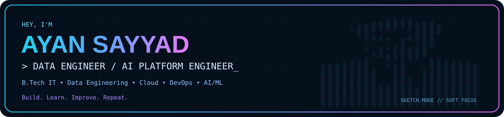
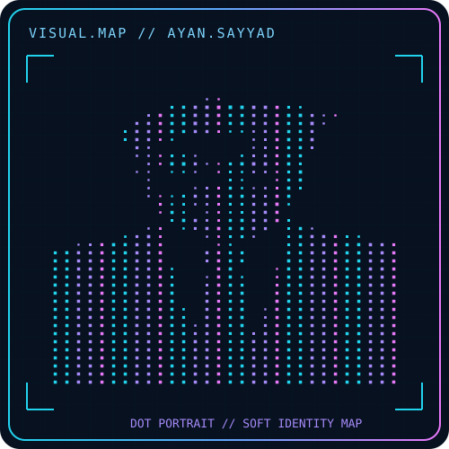
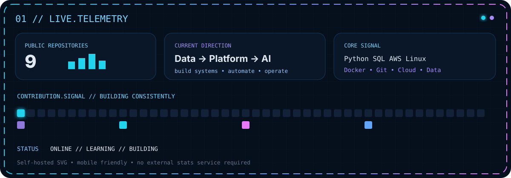
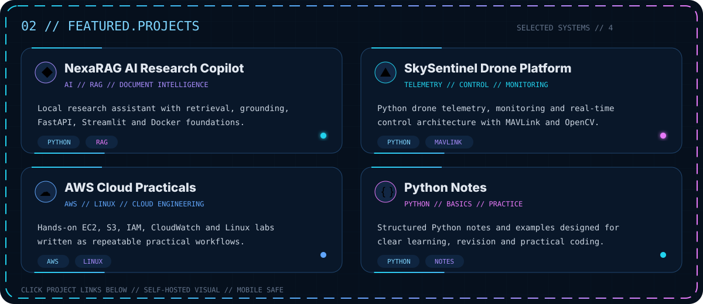

<div align="center">



### `DATA ENGINEERING // CLOUD // DEVOPS // AI PLATFORM`

`Python` · `SQL` · `AWS` · `Linux` · `Git` · `Docker` · `Kubernetes`

**Build. Learn. Improve. Repeat.**

</div>

---

## `00 // PROFILE.COMMAND_CENTER`

<table>
<tr>
<td width="40%" align="center" valign="top">



</td>
<td width="60%" valign="top">

### `SYSTEM.INFO`

```text
Subject    : Ayan Sayyad
Education  : B.Tech Information Technology
Direction  : Data Engineer → Data Platform → AI Platform
Focus      : Data Engineering | Cloud | DevOps | AI/ML
Core       : Python | SQL | AWS | Linux | Git | Docker
Learning   : Kafka | Spark | Airflow | Kubernetes
Mode       : Learn → Build → Break → Fix → Document
Status     : BUILDING...
```

I am building toward the layer where **data, software and infrastructure meet** — reliable pipelines, cloud systems, deployment automation and production-style platforms.

</td>
</tr>
</table>

---

<div align="center">



</div>

---

<div align="center">



</div>

### `PROJECT.LINKS`

- 🧠 **[NexaRAG AI Research Copilot](https://github.com/ayansayyad7000-png/NexaRAG-AI-Research-Copilot)** — Python · RAG · FastAPI · Streamlit · Docker
- 🚁 **[SkySentinel Drone Platform](https://github.com/ayansayyad7000-png/SkySentinel-Drone-Control-Monitoring)** — Python · MAVLink · ArduPilot · OpenCV · WebSocket
- ☁️ **[My-cloud](https://github.com/ayansayyad7000-png/My-cloud)** — AWS · EC2 · S3 · IAM · CloudWatch · Linux
- 🐍 **[Python-Notes](https://github.com/ayansayyad7000-png/Python-Notes)** — Python fundamentals, examples and practice
- 🔧 **[Git-GitHub-Practical](https://github.com/ayansayyad7000-png/Git-GitHub-Practical)** — Git · GitHub · Version Control
- 🐧 **[Ubuntu Command Repository](https://github.com/ayansayyad7000-png/Ubuntu-Command-Repository-)** — Linux · Ubuntu · CLI
- ⚙️ **[GitHub Actions Python CI](https://github.com/ayansayyad7000-png/GitHub-Actions-Python-CI)** — CI/CD · GitHub Actions · Python

---

## `03 // TOOLCHAIN`

```text
LANGUAGES     Python • SQL • Java • C/C++
CLOUD         AWS • EC2 • S3 • IAM • CloudWatch
SYSTEMS       Linux • Ubuntu • Bash
DEVOPS        Git • GitHub • Docker • GitHub Actions
PLATFORM      Kubernetes • Terraform
DATA          PostgreSQL • Kafka • Airflow • Spark • Databricks
AI PLATFORM   RAG • FastAPI • MLflow • Model Serving
```

---

## `04 // BUILD.PATH`

```text
FOUNDATION
Linux + Networking + Git + Python + SQL
        ↓
CLOUD
AWS + IAM + VPC + S3 + EC2
        ↓
AUTOMATION
GitHub Actions + Docker + Terraform
        ↓
PLATFORM
Kubernetes / EKS + Observability
        ↓
DATA
Kafka + Airflow + Spark / PySpark + Databricks
        ↓
MODERN DATA PLATFORM
Data Modeling + Lakehouse + AWS Data Services
        ↓
AI PLATFORM
MLflow + Model Serving + Production Operations
```

---

## `05 // CONTRIBUTION.MOTION`

<div align="center">


</div>

---

<div align="center">

### `BUILD // LEARN // CONNECT // OPERATE // IMPROVE`

**Ayan Sayyad** · B.Tech Information Technology  
Data Engineering · Cloud · DevOps · AI Platform Engineering  
📧 **ayansayyad7000@gmail.com**

</div>